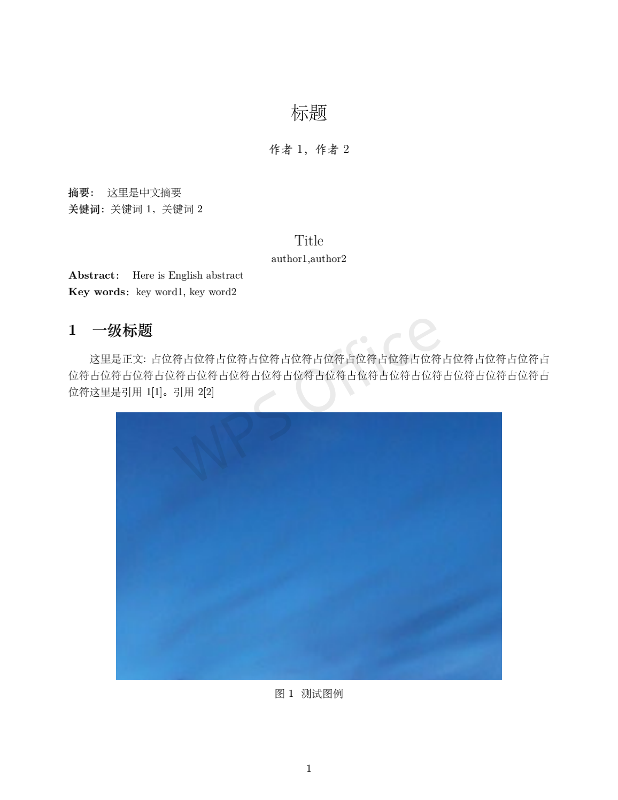
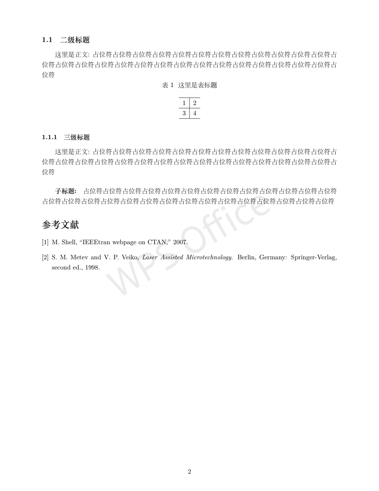

# latex
Latex template for Chinese - Latex中文模板  

*请使用XeLatex作为编译器  

vscode的配置：
```json
{
  "latex-workshop.latex.recipes": [
    {
      "name": "xelatex",
      "tools": [
        "xelatex",
        "bibtex",
        "xelatex",
        "xelatex"
      ]
    }
  ],
  "latex-workshop.latex.tools": [
    {
      "name": "latexmk",
      "command": "latexmk",
      "args": [
        "-synctex=1",
        "-interaction=nonstopmode",
        "-file-line-error",
        "-pdf",
        "%DOC%"
      ]
    },
    {
      "name": "xelatex",
      "command": "xelatex",
      "args": [
        "-synctex=1",
        "-interaction=nonstopmode",
        "-file-line-error",
        "%DOC%"
      ]
    },
    {
      "name": "bibtex",
      "command": "bibtex",
      "args": [
        "%DOCFILE%"
      ]
    }
  ],
  "editor.wordWrap": "on"
}
```

**截图**


